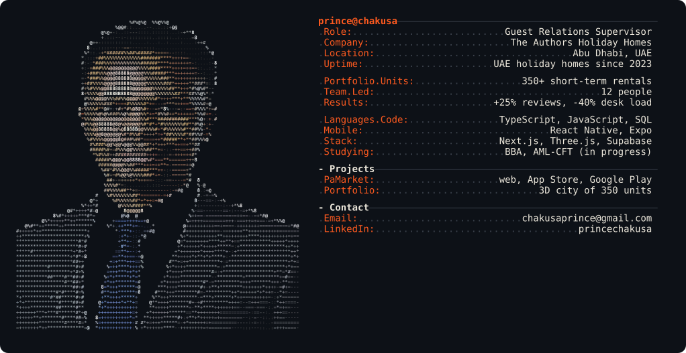
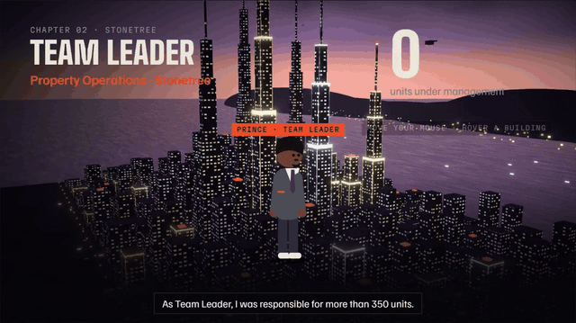
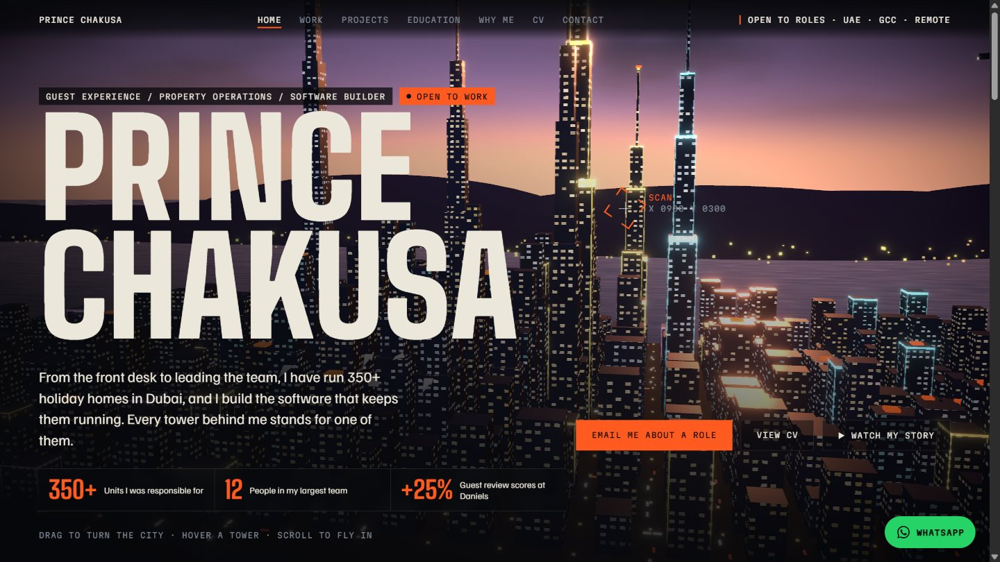
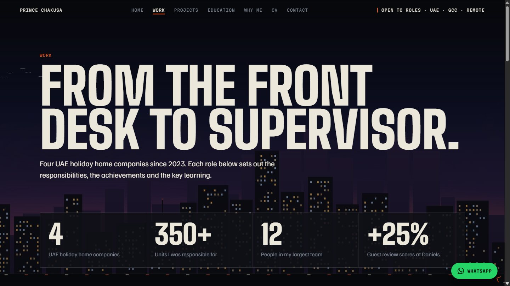
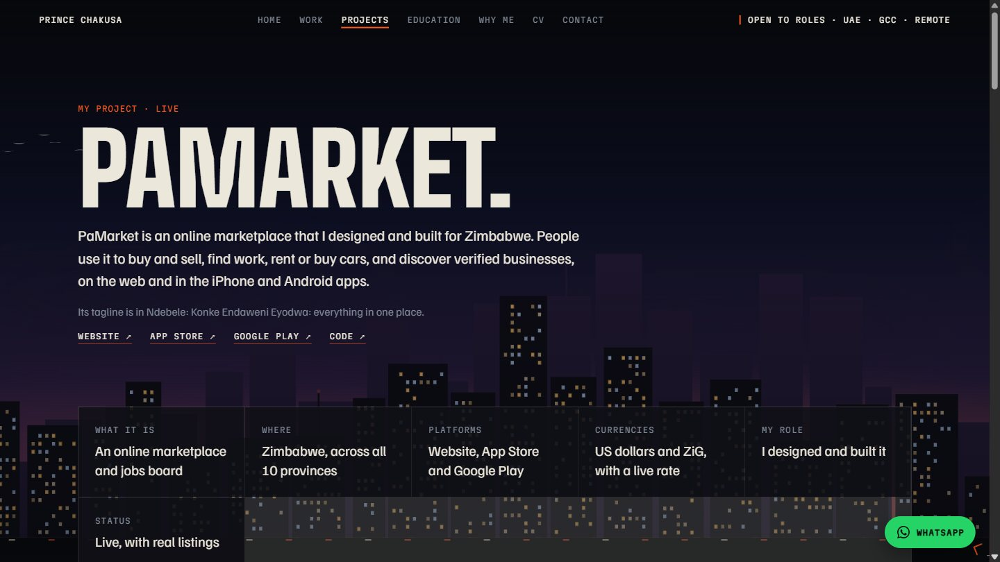
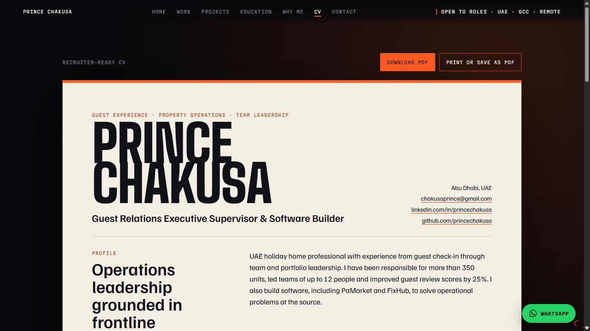

<div align="center">



# Prince Chakusa · Interactive 3D Portfolio

**Guest Experience and Property Operations Leader who also builds software**
Abu Dhabi, UAE · Open to roles in the UAE, the GCC and remote

<a href="docs/media/prince-chakusa-film.mp4"></a>
<a href="web/public/Prince-Chakusa-CV.pdf"></a>
<a href="https://linkedin.com/in/princechakusa"></a>
<a href="https://wa.me/971589772645"></a>


</div>

---

## 🎬 The film

A two-minute narrated film walks through my career, one chapter per role. The Stonetree chapter flies over a real 3D city of the 350+ units I was responsible for, with the team of 12 in front of it.

<p align="center">
  <a href="docs/media/prince-chakusa-film.mp4"></a>
  <br /><sub>▶ <a href="docs/media/prince-chakusa-film.mp4"><b>Watch the full film with sound (MP4, 2:37)</b></a></sub>
</p>

---

## 📄 Resume at a glance

| 350+ | 12 | +25% | 15% | −40% |
|:---:|:---:|:---:|:---:|:---:|
| short-term rental units under my responsibility | people led across concierge, maintenance and housekeeping | guest review scores | lower annual operating costs | front desk workload |

### Experience

**Guest Relations Executive Supervisor** · The Authors Holiday Homes, Abu Dhabi · *Apr 2026 to Present*
- Supervise the guest relations team, ensuring every guest is looked after from arrival to departure.
- Handle escalated guest issues and coach the team to resolve problems at first contact.
- Improved the company's operating systems and team management, so service standards hold on every shift.

**Guest Experience Lead** · Luxury Homevy Vacation Homes, Dubai · *Jan 2026 to Mar 2026*
- Led guest experience operations across a 40-property short-term rental portfolio with a team of 5.
- Built SLA and SOP compliance tracking across Hostaway and WhatsApp.
- Analysed more than 200 guest reviews to identify recurring issues and what guests value most.

**Team Leader, Property Operations** · Stonetree Vacation Homes, Dubai · *Nov 2024 to Dec 2025*
- Promoted from Customer Care Agent to Team Leader of Property Operations.
- Directed day-to-day operations for more than 350 short-term rental units, leading a cross-functional team of 12.
- Standardised operating procedures across all units, reducing annual operational costs by 15%.
- Ensured full DTCM compliance, and managed vendor contracts and service level agreements.

**Guest Relations Officer** · Daniels Holiday Homes, Dubai · *Jan 2023 to Oct 2024*
- Optimised check-in and check-out processes, improving guest review scores by 25%.
- Integrated digital concierge tools, reducing front desk workload by 40%.
- Implemented a CSAT and NPS feedback system, improving guest satisfaction by 20%.

### Education

| Qualification | Status |
|---|---|
| Bachelor of Business Administration | 🟠 In progress |
| AML-CFT Certificate | 🟠 In progress |
| Associate of Science in Computer Science, University of the People | ✅ Completed 2026 |
| Diploma in Business Management, Lyceum College, South Africa | ✅ Completed |
| CompTIA A+ Core 1 | ✅ Certified |

---

## 🛒 PaMarket: live in Zimbabwe

**Konke Endaweni Eyodwa: everything in one place.** A marketplace and jobs board for Zimbabwe that I designed and built. People buy and sell, find work, rent or buy cars and discover verified businesses across all 10 provinces, priced in US dollars or ZiG.

<a href="https://pamarketzw.com"></a>
<a href="https://apps.apple.com/app/id6794616959"></a>
<a href="https://play.google.com/store/apps/details?id=com.pamarket.app"></a>
<a href="https://github.com/princechakusa/PaMarket"></a>

**Built with**

| Layer | Technology |
|---|---|
| Mobile apps (iOS and Android) |     |
| Website (installable PWA) |     |
| Backend and data |    |
| Notifications and monitoring |   |
| Tooling |    |

---

## 🏙️ The portfolio site

<table>
  <tr>
    <td width="50%"><br /><sub><b>Home.</b> A 3D city of 350 towers, one per unit. Drag to turn it, hover a tower, scroll to fly in.</sub></td>
    <td width="50%"><br /><sub><b>Work.</b> Every role with responsibilities, achievements and key learning.</sub></td>
  </tr>
  <tr>
    <td><br /><sub><b>Projects.</b> PaMarket with real screenshots and store links.</sub></td>
    <td><br /><sub><b>CV.</b> Recruiter-ready, with a one-click PDF download.</sub></td>
  </tr>
</table>

<details>
<summary><b>Features</b></summary>

- 3D skyline in React Three Fiber: 350 instanced towers with a procedural lit-window shader, bloom, a dusk sky, harbour, moving traffic and a 360 degree drag-to-turn camera
- Narrated film built with Remotion and played in-page, with a close-able pop-up that respects the visitor's time
- Custom reticle cursor that locks on to towers (desktop only)
- GSAP ScrollTrigger and Lenis smooth scrolling
- Floating WhatsApp button, link-preview card for LinkedIn and WhatsApp, sitemap and robots.txt
- Lighter rendering on phones, reduced-motion support and keyboard-friendly dialogs
- Fully static export: fast and cheap to host anywhere

</details>

<details>
<summary><b>Run it locally</b></summary>

```bash
cd web
npm install
npm run dev      # http://localhost:3000
npm run build    # static site in web/out
```

Set `NEXT_PUBLIC_SITE_URL` to the live address when deploying, and optionally `NEXT_PUBLIC_CF_BEACON_TOKEN` for Cloudflare Web Analytics.

</details>

<details>
<summary><b>Project structure</b></summary>

```
web/
  src/app/          pages: home, work, projects, education, why-me, cv, contact
  src/components/   3D city, cursor, film player, pop-up, nav, footer
  src/film/         Remotion film scenes and voice timing
  src/lib/          all site copy in content.ts
  cv/cv.html        source of the PDF resume
docs/media/         film, GIF and screenshots used in this README
github-profile/     profile README and the ASCII profile card generator
```

</details>

---

<div align="center">

**Let's talk.** chakusaprince@gmail.com · [LinkedIn](https://linkedin.com/in/princechakusa) · [WhatsApp](https://wa.me/971589772645)

</div>
